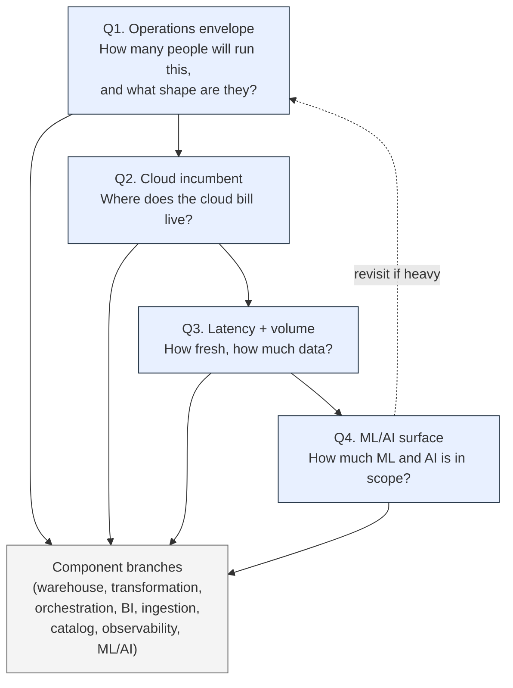

# Assessment tool v0.1
## A hierarchical stack-shortlist tool for the anchor buyer

**Version:** 0.1 (draft)
**Date:** 2026-05-15
**Status:** Living document. Co-evolved with the comparative test bench — cost claims and operational notes that read "TBD — pending Stack #N measurement" lock when the corresponding stack ships against the canonical task set. v1.0 lands after Stack #2 has shipped end-to-end; the first two stacks are what validate that the framework's eliminations and shortlists hold up against measurement.

---

## What this document is

A mixed-audience hierarchical assessment that walks a buyer from business inputs (team shape, cloud incumbent, latency and volume, ML/AI surface) to a viable shortlist of stack components per branch. Sits on top of the comparative test bench as the synthesis layer: the test bench measures, this document chooses.

Two readers in mind, in priority order:

1. **The less-technical buyer** — a founder, COO, CFO, Head of Product, or VP Eng who isn't a data engineer but is making (or signing off on) the stack-selection call. Top-level questions are written in business language; technical answer choices are explained inline; the proxy formulations make the unanswerable questions answerable.
2. **The data engineer or analytics engineer** who has been handed the selection task and wants a defended framework rather than a vendor white paper. Branches go deep enough to ground the shortlist; the technical reader skips over the explanations they don't need.

The output of working through this document is **a per-branch viable shortlist**: typically 2–4 named components per category that pass the buyer's hierarchical constraints, with a written tradeoff among them. It is explicitly **not** a single-pick recommendation. Reducing the shortlist to one is the path-1 consulting conversation — the assessment tool puts the buyer at the door of that conversation, not inside it.

## What this document is *not*

- Not a vendor-funded buyer's guide. The lineup it draws from is the cross-cloud comparative test bench (`stacks/stack-01-athena` through `stacks/stack-05-fabric` as they ship) plus framework-passing tools that aren't measured on the bench. No tool is on a shortlist because it paid to be there.
- Not a market-share survey. The test bench's stack lineup is anchored to the 2026-Q2 job-postings analysis (`canonical/job-postings/`) for the anchor buyer profile, not to vendor revenue rankings.
- Not a substitute for measurement. Where this document makes a cost or operational claim that *can* be measured by the test bench, the claim is tagged as such, and the lock state is "TBD — pending Stack #N" until that stack ships.
- Not stable. v0.1 ships before any test bench stack has measured numbers attached; refresh sequence is documented at the bottom.
- Not an opinionated picker. The project's locked public POV is **fair comparative tester**, not opinionated builder (CLAUDE.md, 2026-05-08). Terminals are viable shortlists; arguments live in the writeups for each shortlisted component, not in a thumb-on-the-scale verdict.

## Who this is calibrated to

The same anchor buyer as the canonical task set (`canonical/task-set.md`, sections "What 'modern analytics architecture expertise' means" and "The anchor buyer profile"): a Series A through mid-market SaaS or comparable company, 50–250 employees, 1–3 data engineers / analytics engineers plus 1 data scientist (the data scientist may not yet be hired at the Series A end of the band — Q4's "None planned in the next 12 months" answer covers that case), tens of GB to low TBs of data, tens of millions of events per month with a growth trajectory toward 10× over 18 months, daily-to-hourly latency dominant, 1–3 production models and 0–2 LLM/RAG features in the ML/AI surface.

Buyers materially smaller or materially larger than this band can still work through the framework; the eliminations and shortlists are calibrated to this profile and will be looser at the edges. The first top-layer question (operations envelope) is where the buyer's actual band gets named.

---

## The four top-layer questions

Top-layer questions form a small interacting graph, not a strict tree. Answering them in order is the default; revisiting Q1 after Q4 is normal (a heavy ML/AI surface can imply a team-shape change the buyer hadn't yet booked).

The four top-layer questions are deliberately ordered: **operations first**, because team capacity is the only constraint in this list that isn't renegotiable in the short term. Latency requirements can be relaxed, volume can be sampled, cloud incumbency can be exited (slowly), ML scope can be sequenced; one engineer cannot be turned into three engineers in time for next quarter's stack decision. Most public stack-selection content opens purpose-first ("what's your use case?") or volume-first ("what scale?"); both bury the constraint that actually does the work. This is a deliberate departure from default modern-data-stack content, defensible from director-level operating experience in the buyer-profile band.

### Q1. Operations envelope — how many people will run this stack day-to-day, and what shape are they?

The load-bearing first question. Everything downstream filters by what the team can credibly operate.

**Proxy formulations** (for the less-technical reader):

- "Who else, besides the person filling out this assessment, will be paged when a pipeline breaks at 2am? Is there a rotation, or is it always the same person?"
- "If your most data-fluent person quit next month, could someone else still keep the lights on? For how long?"
- "How much of your existing engineering bandwidth is already consumed by operational source-system maintenance — does the data team have actual slack for stack ops, or are they already underwater?"

**Answer bands:**

- **A. Generalist part-time (0.5–1 FTE).** An analyst with SQL and some Python, or a PM with technical chops. No on-call rotation, no infrastructure responsibility, no dedicated time for upgrades. This is the floor of the buyer profile and the most aggressive managed-everything constraint. **Eliminates:** self-hosted Airflow in any shape, self-hosted Dagster, OpenMetadata self-hosted, DataHub self-hosted, Kubernetes anything, multi-region warehouse setups, ELT custom Python in production, manually-operated streaming. **Keeps viable:** dbt Cloud (managed), Fivetran, Airbyte Cloud, Snowflake or BigQuery (managed warehouses), Hex or Mode or Lightdash-hosted, MotherDuck for the low end, dbt's bundled scheduler or Dagster Cloud Hybrid free tier for orchestration. Optimized for "operates itself between human touches."
- **B. One dedicated DE or AE, no platform support (1 FTE).** Anchor profile floor. **Eligible:** everything in A, plus lightly-operated OSS: dbt-core with GitHub Actions, Dagster Cloud Hybrid (the agent is the only thing self-operated), Metabase self-hosted against a small RDS Postgres. **Still eliminated:** self-hosted Airflow's scheduler-plus-webserver-plus-metadata-DB-plus-workers shape, OpenMetadata self-hosted, anything Kubernetes-native.
- **C. 1–3 dedicated DE/AE + 1 data scientist, no separate platform team (anchor buyer middle).** This is the band the full test bench lineup is calibrated to. Self-hosted Airflow on a managed container service (AWS Fargate, Cloud Run, ACI) becomes viable. Self-hosted Dagster becomes viable. OpenMetadata self-hosted becomes viable if one engineer takes catalog ownership. dbt-core with a real CI/CD investment becomes preferable to dbt Cloud for cost reasons.
- **D. 3–5 dedicated engineers including someone with infra ops focus (anchor profile ceiling).** Everything in C, plus heavier-weight self-hosted patterns: Airflow on EKS or GKE, OpenMetadata at scale, custom Python ingestion with real reliability investments, multi-region replication. *Note for buyers in this band:* most companies at this team size are still better served by staying on the managed-everything ladder for cost and ramp reasons; this question opens the additional options, it does not endorse them.
- **E. 8+ data org with platform sub-team.** Out of the anchor buyer profile. The framework still applies in shape but the calibration weakens — the right answers for an enterprise data platform team are not what this tool is built to surface. Point users in this band at industry-analyst reports (Gartner, BARC) for headline scans and at custom advisory for selection.

**How Q1 propagates:** A buyer who answers A or B forces the **managed everything** posture through every downstream branch. A buyer who answers C unlocks the test bench's full lineup. D opens additional self-hosted options but the assessment tool's default recommendation remains the managed-or-lightly-operated path unless the buyer's answer to Q4 (ML/AI surface) explicitly opens a "we need to operate our own infrastructure" sub-branch.

### Q2. Cloud incumbent — where does your company's cloud bill live today?

The second-most-load-bearing question. Cloud incumbency is renegotiable in principle but expensive in practice (security re-audit, networking re-architecture, second-vendor contracts, second-cloud team-skill ramp). Most buyers in the anchor profile should stay on their dominant cloud unless Q3 or Q4 forces an exit.

**Proxy formulations:**

- "If your CFO asked which cloud bill is largest, what's the answer?"
- "Where does your operational application database (the one your product runs against) live today?"
- "Does your security or compliance team have a cloud they've already audited and approved? Adding a second one is a project."

**Answer bands and what they map to in the test bench:**

- **AWS-dominant.** Two test bench stacks calibrate here: **Stack #1 (lake-first OSS on S3 + Athena, dbt-core + Airflow on Fargate)** is the cost-disciplined open-source anchor; **Stack #2 (Snowflake-on-AWS, dbt-core + Airflow on Fargate)** is the warehouse-first comparison. **Framework-passing variants** (not measured on the bench): Redshift remains a passing pick but the framework treats it as legacy-stack maintenance in the 2026 hiring data (#3 warehouse at 20%, but mentions correlate with maintenance rather than net-new selection — see `canonical/job-postings/captures/2026-q2/lineup-decision.md`), Databricks-on-AWS, Snowflake-on-AWS with different orchestrator picks. **2026-Q2 hiring data:** AWS appears in 40% of buyer-profile postings; the most common three-tuple is `snowflake | dbt_core | airflow` at 22.5%.
- **GCP-dominant.** **Stack #3 (BigQuery on GCP, dbt-core + Dagster)** is the test bench pick. BigQuery's per-byte-scanned cost model and Dagster's asset-graph cost-observability annotation land cleanly together (see ADR-001 for the orchestrator pairing rationale). **Framework-passing variants:** BigQuery + Airflow (more common in postings, fewer asset-graph affordances), Databricks-on-GCP. **2026-Q2 hiring data:** GCP appears in 12.5% of postings; BigQuery is #2 warehouse at 25%.
- **Azure-dominant.** **Stack #5 (Microsoft Fabric + Power BI on Azure, Fabric Data Factory orchestration)** is the test bench pick — honors the native-platform pitch Fabric is sold on (see ADR-001). **Framework-passing variants:** Snowflake-on-Azure (real consideration for buyers whose security team won't approve a second cloud — Snowflake's Azure region presence is a load-bearing fact here), Databricks-on-Azure, Synapse-as-warehouse with Azure Data Factory (legacy-stack flavor; treat like Redshift in shape). **2026-Q2 hiring data:** Azure appears in 10% of postings; the methodology over-samples SaaS-tech and structurally under-samples the broader Power-BI-heavy mid-market (see lineup-decision.md), so the 10% under-represents Azure's actual buyer-profile relevance in the 100–250-employee mid-market segment.
- **Multicloud-by-history (no single dominant cloud bill).** Lean cloud-agnostic. **Test bench pick: Stack #4 (Databricks lakehouse on a host cloud the buyer specifies).** Snowflake is the cleanest non-Databricks answer — its multi-cloud story is the strongest in the warehouse category. **Framework-passing variants:** Databricks-on-Azure when the buyer's compliance posture favors Azure, Snowflake-on-AWS as the most-popular incumbent. The Q3 latency+volume answer is what tips this band's choice between lakehouse posture (Databricks) and warehouse posture (Snowflake).
- **None / greenfield (pre-cloud, founder still on a laptop).** Below the anchor buyer floor. Default to AWS or GCP based on the team's existing skill, with the cheapest-managed-warehouse pick at the buyer's volume band. Revisit when the company crosses the anchor buyer's floor.

**How Q2 propagates:** Q2 names the cloud; Q3 names the warehouse-or-lakehouse shape within that cloud; Q1's operations envelope decides whether the picks in that cloud are managed or self-hosted; Q4 layers ML/AI atop. The Q2 answer is the strongest single constraint on which test bench stack the buyer is reading first.

### Q3. Latency + volume envelope — how fresh does the data need to be, and how much of it is there?

The question most public stack-selection content opens with. This framework places it third because Q1 and Q2 do more eliminations on average — but for a buyer whose answers to Q1 and Q2 left the field wide open, Q3 is where the warehouse-vs-lake-vs-lakehouse decision crystallizes.

**Proxy formulations for volume (for the less-technical reader):**

- "Roughly how many active customers do you have, and roughly how many events does each customer generate per day in your product? Multiply the two, then multiply by 30 to get monthly event volume. That's the load-bearing number."
- Reference points the framework owns: **~1M events/month** is comfortable on Postgres-as-warehouse; **~10M events/month** is roughly where Postgres-as-warehouse stops scaling cleanly and a real analytics warehouse starts to earn its cost; **~100M events/month** is roughly where the warehouse pick starts to matter for cost (the gap between Snowflake's auto-suspend economics and BigQuery's per-byte-scanned model becomes a real number); **~1B events/month** is comfortably above the anchor buyer profile ceiling.

**Proxy formulations for latency:**

- "What's the worst-case stakeholder ask? 'I want to see this report at 9am Monday' (daily), 'I want to see this within an hour of close' (hourly), or 'I want to see this happen as it happens' (minute-scale or below)?"
- "Of the things stakeholders ask for in 'real time,' how many of them genuinely fail if the answer is one hour stale instead of one second stale?" — flushes out the very common case where 'real time' means 'fresher than I'm getting today,' not 'sub-second.'

**Answer bands (volume × latency, condensed):**

- **<100 GB total + daily-only.** Postgres-as-warehouse is framework-passing (cheapest answer; not in the lineup but listed at the warehouse terminal). Athena lake-first (Stack #1) is the cheapest "real analytics warehouse" answer. Snowflake and BigQuery work but the floor cost is hard to defend against the cost-engineering discipline the anchor buyer cares about — TBD pending Stack #1 / Stack #2 measurement comparison.
- **100 GB – 1 TB + hourly-or-daily.** Every lineup stack passes. Choice tilts back to Q1 and Q2. This is the anchor buyer middle band.
- **1–10 TB + daily.** Warehouse-or-lakehouse becomes the binary. Lake-first (Stack #1) survives if dbt-core build times stay tight (TBD pending Stack #1 measurement at L scale per `canonical/synthetic-dataset.md`); Snowflake, BigQuery, Databricks all comfortable. Athena's query-cost variance starts to matter — pathological queries at this scale are real money.
- **1–10 TB + hourly.** Micro-batch framing is correct. Stack #1 still passes if the orchestrator hits the freshness contracts. Snowflake, BigQuery, Databricks all have headroom. Athena's variance is sharper here — the framework leans warehouse-or-lakehouse at this band unless cost discipline forces lake-first.
- **>10 TB.** Above the anchor buyer ceiling. Warehouse or lakehouse mandatory. Reasses Q1 — at this volume, "1 DE/AE" answers are operationally unsustainable.
- **Sub-minute streaming-required (real-time analytics serving).** Out of buyer profile. **Framework points to ClickHouse, Materialize, RisingWave, Pinot, or Druid** with explicit "not measured on the bench" tag — the canonical task set treats streaming as a sub-surface of ingestion and out-of-scope as a primary BI serving layer (see `canonical/task-set.md` section "Explicit out-of-scope for v0.2"). A buyer who lands here should re-examine whether the stakeholder ask is for genuine sub-minute analytics or for "fresher than yesterday's overnight batch" — the latter is the 100 GB – 1 TB hourly band.

**How Q3 propagates:** Q3 is the single biggest input to the warehouse/storage branch and the second-biggest input to the orchestration branch (sub-hour latency narrows orchestrator picks). Volume affects cost claims directly; the assessment tool's cost claims are tagged with the scale they apply at (S/M/L per the synthetic dataset spec).

### Q4. ML/AI surface — how much ML and AI is currently in your roadmap?

The lightest of the four for most buyers in the anchor profile, but the one that opens the most branches if the answer is non-trivial.

**Proxy formulations:**

- "How many business decisions does your company make today where you'd want a model in the loop? (Examples: 'which customers are at risk of churning?' 'which inbound leads should sales call first?' 'should we approve this credit application?')"
- "Do you have or plan to have AI features in your product itself that use a hosted LLM API — support agent assist, semantic search over your own content, auto-generated copy, summarization?"
- "Will any of these features need to respond to a user in real-time (online inference), or can they run on a schedule (batch, e.g., a nightly job that scores all customers)?"

**Answer bands:**

- **None planned for the next 12 months.** Category 9 collapses entirely. Picks made on Q1 + Q2 + Q3 alone. The ML/AI branch can be skipped in the buyer's first pass through this document.
- **1–3 batch models, no LLM/RAG (lower end of anchor buyer ML surface).** Adds: experiment tracking and model registry (MLflow self-hosted is the test bench reference; Weights & Biases managed is the framework-passing managed alternative). Batch inference runs as a SQL or Python task in the orchestrator already in the shortlist from Q3 — no separate decision. Online serving (Q4's high-end concern) does not enter.
- **1–3 batch + 1–2 LLM/RAG features (anchor buyer middle).** Adds the vector DB sub-question (pgvector on existing Postgres is the cheapest framework-passing answer; Pinecone, Weaviate, Qdrant, Chroma, or OpenSearch are framework-passing alternatives at higher retrieval volume), the LLM provider choice (Anthropic, OpenAI, Bedrock, Vertex AI, Azure OpenAI — usually constrained by Q2 cloud incumbency), and LLM cost observability (a real category — the observability branch covers it). Most stacks in the lineup support this surface without architectural strain; the differentiator becomes how cleanly the orchestrator handles heterogeneous-asset DAGs (canonical task 4.7) and how the catalog handles model lineage (canonical task 7.8) — both of which the test bench measures.
- **Online inference at sustained QPS, custom training, or LLM fine-tuning.** Out of the anchor buyer profile (see canonical task-set 9.x exclusions). **Framework points to SageMaker, Vertex AI, Modal, or BentoML** with explicit "out of scope, not measured on the bench" tag. A buyer landing here should re-examine whether the team shape (Q1) is adequate to the operational surface — heavy online ML inference is rarely operable by 1–3 DE/AE without an ML engineer.

**How Q4 propagates and the revisit-Q1 loop:** A buyer who answers "anchor middle" or higher in Q4 should revisit Q1. The ML/AI surface adds operational load that doesn't always fit into the team-shape answer the buyer gave first. The framework's default recommendation when Q4 stretches Q1 is to either shrink the ML/AI roadmap or expand the team — not to take on heavyweight ML serving infrastructure inside a 1-FTE generalist constraint.

---

## Component branches

Each branch below assumes the buyer has worked through Q1–Q4 and is now answering a category-specific sub-question that filters to a viable shortlist. Branches are short by design — the goal is the shortlist plus the tradeoff among shortlisted components, not an exhaustive technology survey.

### Warehouse / storage

**Sub-question:** "Given your latency, volume, and cloud answers, which storage-and-query shape fits?"

**Eliminations driven by Q3 (volume):**

- <100 GB: Postgres-as-warehouse (framework-passing, not in lineup) is the cheapest answer; all warehouses pass but most overspend.
- 100 GB – 10 TB: All warehouses pass. Lake-first picks (Athena) pass cleanly on cost; warehouse-first picks (Snowflake / BigQuery) pass cleanly on ergonomics.
- 10 TB+: Warehouse or lakehouse only.

**Eliminations driven by Q2 (cloud):**

- AWS-dominant: Athena (Stack #1), Snowflake-on-AWS (Stack #2), Redshift (framework-passing-legacy), Databricks-on-AWS (framework-passing).
- GCP-dominant: BigQuery (Stack #3), Databricks-on-GCP (framework-passing), Snowflake-on-GCP (framework-passing, smaller region footprint).
- Azure-dominant: Fabric (Stack #5), Snowflake-on-Azure (framework-passing), Databricks-on-Azure (framework-passing), Synapse (framework-passing-legacy).
- Multicloud: Databricks (Stack #4), Snowflake (framework-passing across multiple clouds).

**Tradeoff to write up at the terminal:**

- Lake-first (Athena, lakehouse-with-open-table-formats) — cheapest at floor, query-cost variance, more operational ergonomics work to do.
- Warehouse-first (Snowflake, BigQuery, Redshift) — higher floor cost, lower variance, less ergonomics work, vendor coupling.
- Lakehouse (Databricks with Delta, Iceberg-on-X) — middle ground on cost and ergonomics, heaviest on team-shape requirement (Q1: typically C or higher).

**Cost claims:** TBD per Stack #N at S / M / L scale. Per-month operating-cost numbers will lock as each test bench stack ships measurement against `canonical/synthetic-dataset.md`.

### Transformation

**Sub-question:** "Who's writing the transformation logic, and how much Python do you need alongside SQL?"

**Eliminations driven by Q1 (operations envelope):**

- Q1 = A (generalist part-time): dbt Cloud or SQLMesh-managed. Self-hosted transformation tooling is eliminated.
- Q1 = B+: dbt-core (test bench reference across Stacks #1, #2, #3), dbt Cloud (framework-passing), SQLMesh (framework-passing, newer; less hiring-data presence at 2026-Q2 capture), Dagster software-defined assets with Python (Stack #3 picks this up alongside dbt for ML feature engineering — canonical task 3.7).

**Eliminations driven by Q4 (ML/AI surface):**

- Q4 includes feature engineering: dbt-core's Python models or Dagster's Python assets are the cleanest paths. Pure-SQL transformation stays viable for everything else.

**Hiring-data anchor (2026-Q2):** dbt_core is #1 transformation tool at 42.5% of postings; nothing else is close.

**Terminal shortlist (anchor buyer middle):** dbt-core, dbt Cloud, SQLMesh. Pick on cost (dbt-core wins) vs. operational overhead (dbt Cloud wins) vs. forward-looking SQL-first ergonomics (SQLMesh leans modern).

### Orchestration

**Sub-question:** "Which orchestrator family fits your team shape and your warehouse / lakehouse pick?"

This is the branch where the test bench's `adrs/ADR-001-orchestrator-strategy.md` carries the most weight — read it for the per-stack rationale.

**Eliminations driven by Q1:**

- Q1 = A: dbt Cloud's bundled scheduler, Dagster Cloud (managed), or Prefect Cloud. Self-hosted Airflow eliminated.
- Q1 = B+: Self-hosted Airflow on a managed container service (Fargate, Cloud Run) is viable. Dagster Cloud Hybrid is viable.

**Eliminations driven by Q2 (cloud) and stack-shape:**

- Databricks lakehouse: Databricks Workflows (native, recommended — see ADR-001).
- Fabric on Azure: Fabric Data Factory (native, recommended — see ADR-001).
- Snowflake or BigQuery or Athena: orchestrator is a real choice — Airflow vs. Dagster vs. Prefect.

**Eliminations driven by Q4 (ML/AI surface):**

- Heavy heterogeneous-asset DAGs (canonical task 4.7) tilt toward Dagster's asset-graph model — see ADR-001's Stack #3 rationale.
- Pure batch ML inference fits Airflow's task-DAG idiom cleanly.

**Hiring-data anchor (2026-Q2):** Airflow #1 at 40%, Dagster #2 at 20%.

**Terminal shortlist (anchor buyer middle, cloud-agnostic):** Airflow self-hosted on managed containers, Dagster Cloud Hybrid, Prefect Cloud. The test bench validates Airflow on Stacks #1 and #2 and Dagster on Stack #3; Prefect is framework-passing but not measured.

### Ingestion / ELT

**Sub-question:** "How many sources, what shapes, and how much custom code are you willing to maintain?"

**Eliminations driven by Q1:**

- Q1 = A: Fivetran or Airbyte Cloud. Custom Python ingestion eliminated.
- Q1 = B+: Airbyte OSS or Meltano viable for cost-disciplined teams; custom Python for edge-case sources (the test bench plans both).

**Eliminations driven by source mix:**

- Heavy SaaS-API source mix (CRM, payments, marketing): managed connector library breadth (Fivetran, Airbyte) dominates the tradeoff.
- Heavy CDC from operational Postgres: Debezium-based (Airbyte OSS, custom Debezium, DMS on AWS) or Fivetran CDC.
- File-drop / partner CSV: custom Python or Airbyte file connector; trivial for any candidate.

**Terminal shortlist (anchor buyer middle):** Airbyte OSS self-hosted (Stack #1 test bench reference, TBD which flavor), Fivetran (managed alternative, cost crossover with Airbyte OSS at higher row counts is TBD pending Stack #1 measurement), Meltano (framework-passing, less common in 2026-Q2 hiring data). Custom Python for the long tail of unusual sources.

### BI / serving

**Sub-question:** "Who are the dashboard consumers, and how heavily do you need a semantic layer?"

**Eliminations driven by Q2 (cloud) and ecosystem gravity:**

- Azure-dominant: Power BI (Stack #5 reference; the #1 BI tool by seat count, hard to beat on Azure).
- AWS or GCP-dominant with engineering-oriented consumers: Lightdash (Stack #1 reference TBD), Metabase, Hex, Mode, Preset/Superset all viable.
- Enterprise-flavored or large-stakeholder-count: Looker (paid; framework-passing across clouds).

**Eliminations driven by semantic-layer needs (canonical task 5.2):**

- Heavy metric-consistency needs: Cube, dbt Semantic Layer, Looker (LookML), MetricFlow.
- Light needs: BI-tool-native semantic layer (Lightdash, Metabase) suffices.

**Hiring-data anchor (2026-Q2):** Power BI shows up most often in the Azure-skewed mid-market; Looker and Tableau next; Metabase and Lightdash material at the Series A end.

**Terminal shortlist (anchor buyer middle, AWS/GCP):** Lightdash, Metabase, Hex, Mode, Preset. Pick on consumer technicality (engineers prefer Lightdash/Hex; non-technical prefer Metabase/Mode) and on semantic-layer integration (Lightdash + dbt is the tightest pairing in the lineup).

### Catalog / governance

**Sub-question:** "Does your buyer profile genuinely need a catalog, or are dbt docs enough?"

**Eliminations driven by Q1:**

- Q1 = A or B: dbt docs only, or Atlan (managed) if budget allows. OpenMetadata self-hosted is eliminated on operational load.
- Q1 = C+: OpenMetadata self-hosted (Stack #1 reference, TBD), DataHub (framework-passing), Atlan (managed framework-passing).

**Eliminations driven by Q2 (cloud) and stack-shape:**

- Databricks: Unity Catalog is the native pick at Stack #4 — competes directly with OpenMetadata for the catalog role.
- Fabric on Azure: Purview is the native Azure catalog; Fabric has its own catalog surface (Stack #5 will document the surface boundary).

**Hiring-data anchor (2026-Q2):** Catalog is the category with the most "none stated" in postings — the framework treats this as evidence that catalog selection lags warehouse and orchestrator selection in the anchor buyer profile, not as evidence that catalogs don't matter.

**Terminal shortlist (anchor buyer middle):** OpenMetadata self-hosted, DataHub self-hosted, Atlan (managed), Unity Catalog (Databricks-only). dbt docs only is framework-passing for the smallest end of the buyer profile.

### Observability / data quality

**Sub-question:** "Do you need PR-time tests, runtime monitoring, or both?"

**Eliminations driven by Q1:**

- Q1 = A or B: dbt tests + Elementary (managed) or Soda Cloud. Monte Carlo (paid) framework-passing if budget; self-hosted Great Expectations eliminated on operational load.
- Q1 = C+: dbt tests + Elementary (self-hosted at Stack #1 reference, TBD), re_data, Soda, Great Expectations self-hosted.

**Eliminations driven by Q4 (ML/AI surface):**

- ML/AI surface includes deployed models (canonical task 6.7): observability stack needs to cover model output / input drift. Native picks (Elementary's model-monitoring extensions, dbt tests with custom checks) compete with dedicated ML monitoring (Evidently, Arize, WhyLabs). Test bench evaluates whether the native data-observability tool's ML extensions suffice for the anchor buyer's ML/AI surface — TBD pending Stack #1 implementation of 6.7.

**Terminal shortlist (anchor buyer middle, data only):** dbt tests + Elementary, dbt tests + re_data, Soda, Monte Carlo (paid). **Plus, if ML/AI surface is non-trivial:** add Evidently (OSS) or Arize (paid).

### ML/AI enablement (sub-questions)

This branch only opens if Q4 ≥ "1–3 batch models." Sub-questions:

- **Experiment tracking + model registry:** MLflow self-hosted (test bench reference for the anchor profile; cheapest credible option), Weights & Biases (managed), Neptune (managed), Vertex AI / SageMaker / Azure ML built-ins (framework-passing if Q2 cloud incumbent matches).
- **Batch inference:** dbt-Python or Dagster Python asset (in-orchestrator), SageMaker batch transform (AWS), Vertex AI batch prediction (GCP), Databricks model serving batch mode (Stack #4). Most anchor-buyer batch ML fits comfortably inside the orchestrator already chosen.
- **Online inference (low-QPS only — single-digit QPS sustained; canonical task 9.5):** FastAPI on Fargate/Cloud Run (test bench reference TBD), Modal (managed), BentoML (framework-passing), SageMaker endpoints (AWS), Vertex AI endpoints (GCP). Heavyweight online serving is out of the anchor buyer profile — see canonical task-set 9.x exclusions.
- **Vector DB (only if Q4 includes LLM/RAG):** pgvector on existing Postgres (cheapest framework-passing answer, viable to ~1M chunks), Pinecone (managed), Weaviate, Qdrant, Chroma, OpenSearch (framework-passing on AWS). Test bench Stack #1 reference TBD.
- **LLM provider (only if Q4 includes LLM/RAG):** constrained by Q2 cloud incumbency — Bedrock on AWS, Vertex AI on GCP, Azure OpenAI on Azure, plus direct Anthropic / OpenAI / Together APIs across all clouds. Pick on model availability, region presence, and contract terms.
- **RAG framework:** LangChain, LlamaIndex, Haystack, or raw orchestration with provider SDKs. The test bench plans to compare LangChain vs. raw orchestration at Stack #1 — TBD which lands as the reference.

### IaC and CI/CD (cross-cutting)

**Sub-question:** "Which IaC tool, and which CI/CD platform?"

**IaC:** Terraform across all five test bench stacks (locked 2026-05-10 — see `adrs/ADR-002` once drafted; the call is in CLAUDE.md). Framework-passing alternatives: Pulumi (multi-language IaC, framework-passing), CDK (AWS-only, framework-passing on AWS-only stacks but the cross-cloud framing rules it out as the cross-stack default), OpenTofu (Terraform-compatible fork, interchangeable).

**CI/CD:** GitHub Actions across the test bench (cheapest credible option for the anchor profile). Framework-passing: GitLab CI, CircleCI, dbt Cloud's bundled CI for dbt-only teams.

Hiring-data anchor: Terraform shows up in 60–70%+ of buyer-profile postings; CDK is single-digit.

---

## Worked examples

Three buyer scenarios traced through the framework. These are illustrative, not exhaustive — the terminals are *shortlists*, not picks, and the consulting conversation that reduces shortlist-to-pick is path-1 territory.

### Example 1 — Series A SaaS, AWS-incumbent, 1 DE, light ML

**Inputs:**

- Q1: B (one dedicated DE, no platform support)
- Q2: AWS-dominant
- Q3: 200 GB total, hourly latency acceptable, ~20M events/month
- Q4: 1 batch churn model in production; no LLM/RAG yet

**Shortlist:**

- Warehouse / storage: Athena lake-first (Stack #1 — cost wins given the cost discipline implied by a 1-DE team) **OR** Snowflake-on-AWS (Stack #2 — ergonomics win, the question becomes "is the monthly Snowflake bill defensible?"). Redshift framework-passing-legacy if there's existing Redshift commitment.
- Transformation: dbt-core (cost-wins-at-this-team-shape default).
- Orchestration: Airflow on AWS Fargate (test bench validates this on Stack #1 / Stack #2; expected $30–50/mo at 24/7, TBD pending Stack #1 measurement). Dagster Cloud Hybrid as framework-passing alternative if the team prefers asset-graph ergonomics.
- Ingestion: Airbyte OSS (cost-disciplined) or Fivetran (managed, if HubSpot + Stripe at low row counts keeps Fivetran in the free tier).
- BI: Lightdash + dbt (tightest integration), Metabase (lower-skill consumers), or Hex (analyst-first).
- Catalog: dbt docs only at this team size; OpenMetadata self-hosted is over-scoped.
- Observability: dbt tests + Elementary self-hosted.
- ML: MLflow self-hosted, batch inference as a dbt-Python or Airflow task — no separate online serving infrastructure.

**Tradeoff to surface in consulting:** Stack #1 (lake-first) vs. Stack #2 (Snowflake-on-AWS). The cost-vs-ergonomics call is the consulting conversation; both pass the framework's eliminations.

### Example 2 — Mid-market SaaS, Azure-incumbent, 2 DE + 1 DS, anchor-middle ML/AI

**Inputs:**

- Q1: C (2 DE + 1 DS, no separate platform team)
- Q2: Azure-dominant (security team has approved Azure only)
- Q3: 1.5 TB total, daily latency for most things plus hourly for a revenue dashboard, ~80M events/month
- Q4: 2 batch models + 1 LLM/RAG feature (support-agent assist over internal KB)

**Shortlist:**

- Warehouse / storage: Fabric (Stack #5 — native Azure, integrates with Power BI most cleanly), Snowflake-on-Azure (framework-passing, real consideration if the team wants Snowflake's cross-cloud portability without leaving Azure today), Databricks-on-Azure (framework-passing, if the lakehouse posture appeals).
- Transformation: dbt-core, Fabric's native transformation surface, or SQLMesh.
- Orchestration: Fabric Data Factory (native to Stack #5), or self-hosted Airflow on Azure Container Apps if the team picks Snowflake-on-Azure instead.
- BI: Power BI (default for Azure-incumbent, hard to beat on the Azure ecosystem).
- Catalog: Microsoft Purview (Azure-native), Fabric's catalog surface, or Atlan (managed alternative).
- Observability: Soda Cloud, Monte Carlo, or dbt tests + Elementary (depending on transformation choice).
- ML: Azure ML (cloud-native), MLflow self-hosted on Azure (framework-passing); vector DB for the LLM/RAG feature could be pgvector on Azure Postgres (cheapest), Azure AI Search, or Pinecone (managed).

**Tradeoff to surface:** Fabric (native, lower friction inside Azure, capacity-pricing model that may not amortize at this volume) vs. Snowflake-on-Azure (warehouse ergonomics, cross-cloud portability later, different cost shape). The Q3 volume is exactly where Fabric's F-SKU capacity floor needs to be measured against actual usage — TBD pending Stack #5 measurement.

### Example 3 — Series B SaaS, multicloud-by-history, 3 DE, no ML

**Inputs:**

- Q1: C (3 DE, no separate platform team)
- Q2: Multicloud-by-history — product runs on AWS, but compliance posture favors GCP, and there's an existing GCP project the data team prefers
- Q3: 5 TB, hourly latency, ~300M events/month
- Q4: None planned in next 12 months

**Shortlist:**

- Warehouse / storage: Snowflake (cloud-agnostic, Stack #2 reference applies cross-cloud), Databricks (Stack #4 reference; lakehouse posture), BigQuery on GCP (Stack #3 reference if the team commits to GCP), Athena on AWS (Stack #1 if the team commits to AWS).
- Transformation: dbt-core.
- Orchestration: depends on warehouse — Airflow if Snowflake or Athena, Dagster if BigQuery, Databricks Workflows if Databricks.
- BI: Lightdash, Metabase, Hex, or Looker (paid framework-passing for enterprise-leaning stakeholder count).
- Catalog: OpenMetadata self-hosted (team has capacity), DataHub, or Unity Catalog (if Databricks).
- Observability: dbt tests + Elementary self-hosted.
- ML: not needed.

**Tradeoff to surface:** Picking a cloud is the consulting conversation here, and Q3's hourly latency + 300M events/month is where Snowflake's auto-suspend vs. BigQuery's per-byte-scanned cost model produce real diverging cost shapes — TBD pending Stack #2 and Stack #3 measurements. Databricks is in the shortlist for buyers who actually believe they'll need ML in 18 months despite Q4 saying "none planned in 12."

---

## Cost claims and pending Stack #N measurements

Every cost claim in this document is tagged with one of three states:

- **Locked.** Backed by measurement on the test bench at a named scale (S, M, or L per `canonical/synthetic-dataset.md`).
- **TBD pending Stack #N.** Will lock when the corresponding test bench stack ships measurement.
- **Out of scope.** The number lives in a vendor-funded benchmark or analyst report; we don't make a claim.

v0.1 ships with zero locked cost claims by definition — no test bench stack has measured numbers yet. The first cost claims lock when Stack #1 ships its first end-to-end measurement at S scale (Phase 1, weeks 3–7 per CLAUDE.md's phase plan). Subsequent stacks lock the cross-stack cost comparisons.

A reader using v0.1 to make a real selection call should treat the cost numbers as **directional, not measured**, until the corresponding stack's measurement lands. The framework's eliminations and shortlists are defensible from architecture-shape reasoning and hiring-data frequency; the cost numbers are not yet.

---

## Refresh policy

- **Each Stack #N ship** triggers an assessment-tool refresh pass. Cost-claim TBDs corresponding to that stack lock; tradeoff narratives at the shortlist terminals get sharpened with the actual operator notes from implementation.
- **Each quarterly job-postings refresh** triggers a re-check of the hiring-data anchors named throughout this document. If a component's hiring frequency shifts materially (10+ percentage points QoQ), the relevant branch's terminal is reconsidered.
- **Major framework structural changes** (e.g., adding a fifth top-layer question, splitting a branch) bump the spec version. v0.1 → v0.2 carries no compatibility promise; readers using v0.1 to make a selection call should re-read the relevant branches at v0.2.
- **The assessment tool itself is a candidate post.** When v0.1 is genuinely usable by a stranger (post-Stack-#1 measurement at minimum), the announcement post comes out of `posts/drafts/` — `stem-03-assessment-tool-announcement` is the slot.

---

## Open questions / v0.2

- **Naming.** "Assessment tool" is a working placeholder per CLAUDE.md's 2026-05-11 lock. Revisit if a sharper name emerges during the first reader pass — candidates: "stack shortlist tool," "selection framework," "buyer's first cut." None of these are great. Defer the rename until there's a real second draft to brand.
- **Top-layer expansion.** Two candidate fifth questions came up while drafting: (a) **compliance posture** (SOC 2, GDPR, HIPAA — different stacks have very different audit-evidence shapes); (b) **build-vs-buy bias** (some buyers walk in with an explicit preference that overrides framework eliminations). Both belong in the framework somewhere; v0.1 folds (a) into Q1's operations envelope and (b) into the per-branch tradeoffs. Promote to top-layer if Stack #N implementation surfaces that the fold isn't carrying the weight.
- **Decision-tree visualization.** v0.1 uses prose-plus-Mermaid for the top layer. A full interactive decision tree (clickable terminal nodes, dynamic shortlist) is the obvious v0.2+ format. Defer until v0.1 has been used in at least one real buyer conversation and the rough edges in the question wording have been corrected. Format decision lives with the blog-platform call (Substack vs. self-hosted, deferred to the post window).
- **Proxy formulation calibration.** v0.1's proxy formulations are written from operating experience in the buyer-profile band; they have not been tested against real non-technical readers. Calibrate when the first path-1 conversation runs against this framework — if a buyer's COO can't answer Q1's proxies cleanly, the proxies need rewriting.
- **Branch coverage for Stack #5-specific surfaces.** Fabric's capacity-pricing model and Power BI's per-seat licensing are not yet folded into the cost section here. Lock when Stack #5 ships measurement.

---

## Versioning

- **v0.1 (2026-05-15):** Initial draft. Four top-layer questions (operations envelope, cloud incumbent, latency + volume, ML/AI surface). Nine component branches (warehouse / storage, transformation, orchestration, ingestion, BI, catalog, observability, ML/AI sub-questions, IaC/CI/CD). Three worked examples. Hybrid source universe at every terminal (test bench stacks named + framework-passing tools tagged). Cost claims uniformly TBD pending Stack #N measurement.
- **v0.2 (target: after Stack #1 ships measurement):** First locked cost claims (Stack #1 monthly run cost, dbt-core build time at S/M scales, Athena query cost variance at L). Stack #1 operator notes folded into tradeoff narratives at the warehouse and orchestration terminals. ADR-002 (Terraform) reference link added once drafted.
- **v0.3 (target: after Stack #2 ships measurement):** Cross-stack cost comparison locked for the AWS slice (Stack #1 lake-first vs. Stack #2 Snowflake-on-AWS). The single sharpest comparison in the framework for the AWS-dominant buyer; sharpens Example 1's tradeoff to a real number.
- **v1.0 (target: after Stack #2 ships measurement + first path-1 engagement runs the framework end-to-end with a real buyer):** Locks the framework's structure and language. v1.0 is the version that goes in the announcement post.
